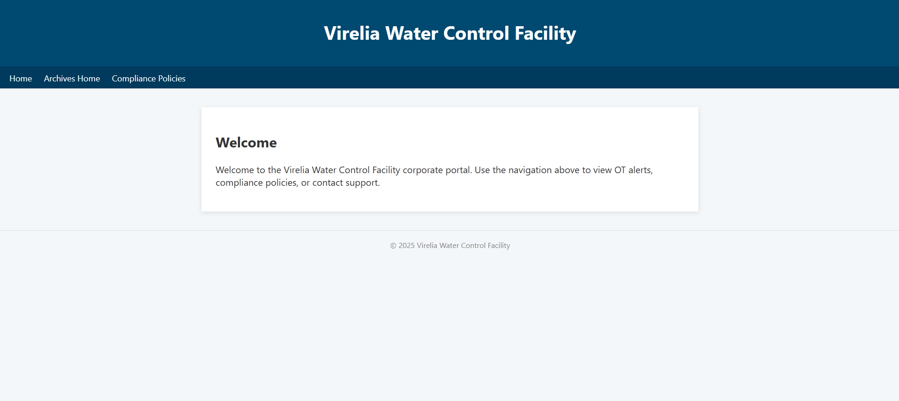
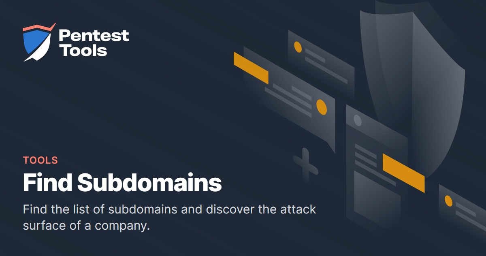
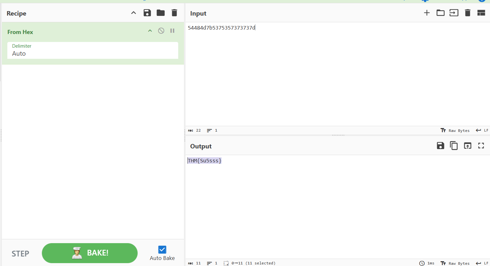

# 

## Description

Hexline, we need your help investigating the phishing attack from 3 months ago. We believe the threat actor managed to hijack our domain virelia-water.it.com and used it to host some of their infrastructure at the time. Use your OSINT skills to find information about the infrastructure they used during their campaign.

## Solving Steps

### Step 1: Find out More About the Website

---

## 

Finally, an OSINT challenge! This is what I've been waiting for! So, first things first, we need to analyze the content of the website. <a href="https://virelia-water.it.com/">Click here to view the website</a>. However, nothing seems to be out of the ordinary when I looked into the website.

The challenge's description did mention something about an infrastructure. One of the things that qualify as an infrastructure is a subdomain. Hackers could possibly set up a secret subdomain that you don't know of in your website. Lets try to check if this is true.

### Step 2: Finding Subdomains

---

I found this pretty neat website for finding subdomains. <a href="https://pentest-tools.com/information-gathering/find-subdomains-of-domain">Click here to view the website</a>. All you need to do is input the domain name and this website will find all available subdomains.

After the website is done scanning, it reveals that our website has two subdomains. That being <b>stage0.virelia-water.it.com</b> and <b>54484d7b5375357373737d.virelia-water.it.com</b>

---

I was stuck for a long while because I had no idea what the flag could be. I searched far and wide at the <b>stage0.virelia-water.it.com</b> subdomain (because the other subdomain can't be opened) but found nothing related to this challenge.

---

Here is when I realized that the other subdomain looked awfully a lot like hex. Decoding the random gibberish would result in the flag we're looking for this whole time.

---

**`THM{Su5sss}`**

### What I Learned

I learned how to conduct OSINT on websites by checking their subdomains for a reconnaissance process.
