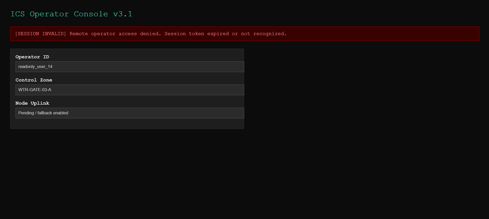
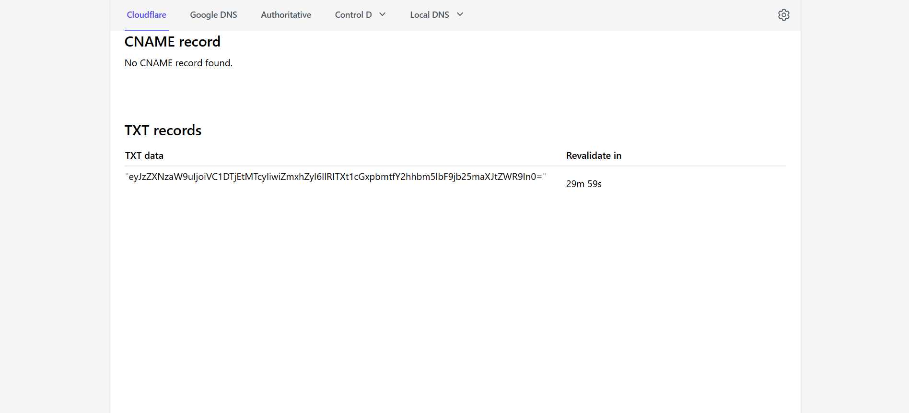
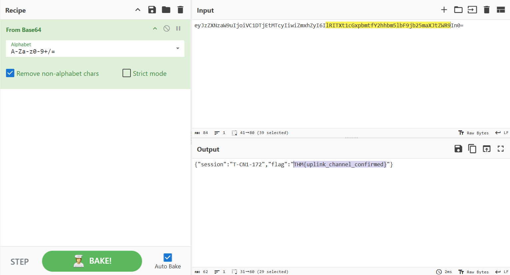

# 

## Description

Great work on uncovering that suspicious subdomain, Hexline. However, your work here isn’t done yet, we believe there is more.

## Solving Steps

### Step 1: Investigate the Other Subdomains

---



From the previous challenge, we know that there's another subdomain, which is <b>stage0.virelia-water.it.com</b>. <a href="https://stage0.virelia-water.it.com/">Click here to view the website</a>. The website seems to be of an ICS Operator Console but we can't interact with it.

I inspected the source code of the HTML file and found a javascript file reference from github. Here's the preview of that Javascript file:

```js
var beacon = {
  session_id: "O-TX-11-403",
  fallback_dns: "uplink-fallback.virelia-water.it.com",
  token: "JBSWY3DPEBLW64TMMQQQ==",
};
```

### Step 2: Figuring out What This Means

---

I was also stuck here for a while as I didn't knew what to do with this information. Since you can't interact with the webpage either it made me more confused. But then I had an idea. What if there's an online service that could search up dns servers?

---



I then found a website that could enable users to search up DNS records for a domain. <a href="https://www.nslookup.io/">Click here to view the website</a>. When we type in the fallback_dns we previously got into this website, it results in one TXT record that seems to be a base64 encoding.

---



Decoding it will result in the flag we're looking for. This challenge took me way too long. Probably because I was overthinking it.

---

**`THM{uplink_channel_confirmed}`**


### What I Learned

I learned that you could search up DNS records up online. This means tons of things in the internet are actually open source at this point as long as you're witty enough to find them.
