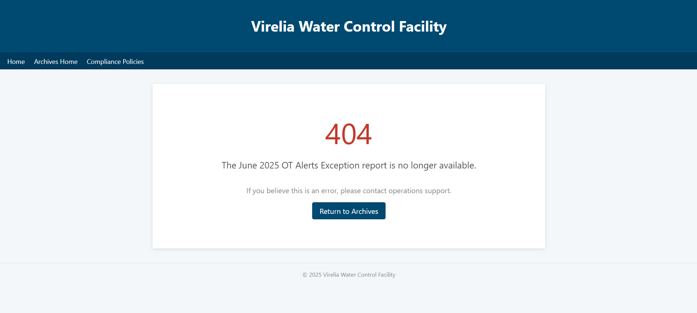
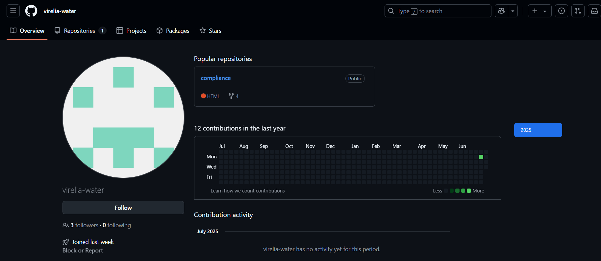
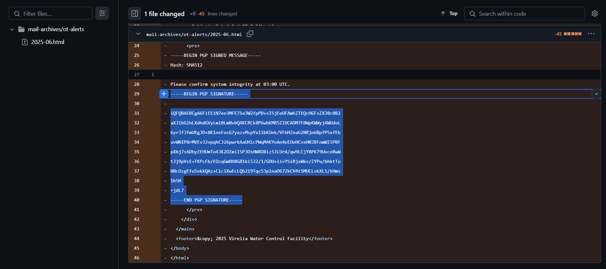
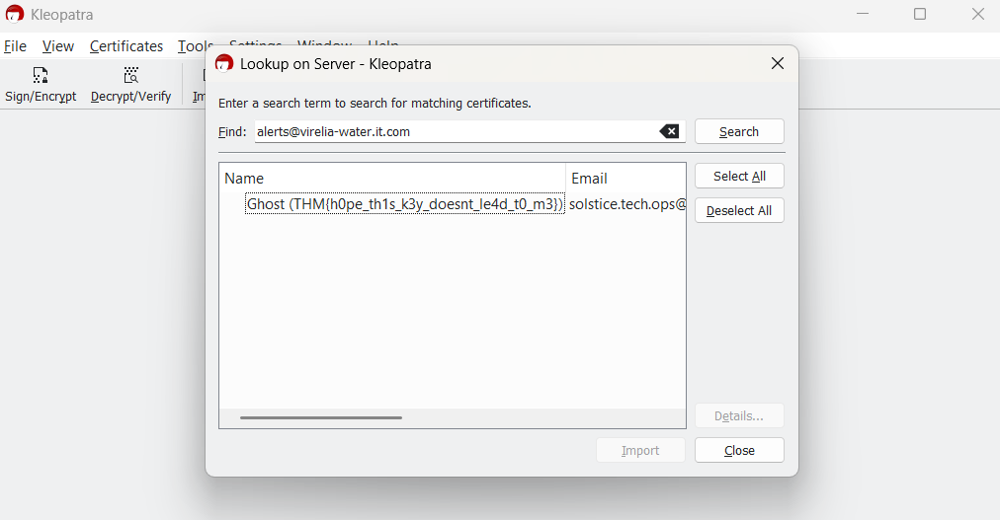

# 

## Description

After the initial breach, a single OT-Alert appeared in Virelia’s monthly digest—an otherwise unremarkable maintenance notice, mysteriously signed with PGP. Corporate auditors quietly removed the report days later, fearing it might be malicious. Your mission is to uncover more information about this mysterious signed PGP maintenance message.

## Solving Steps

### Step 1: Find the OT-Alert

---

In the original website, I noticed there was a section dedicated towards all the OT-Alert messages at a certain timeframe. However, when I tried to open it in the website, there were no results.

---

I tried using the wayback machine along with archive.today because I was sure that past instances of the website that had these alerts have been documented before. Turns out I was wrong and there were no results.

---

Then, one of my teammates sent me a link to a github profile. The github profile being of virelia-water itself. It has one repository and it's the virelia-water website. With this in mind, I tried searchig for the PGP key. There's one folder in the repository and its name is "ot-alerts". Inside of the folder lies an HTML file of the OT-alert during June 2025.

---

Upon opening the HTML file, it's just the same as the actual website. But remember, we can see commit histories in Github. This means that we could potentially find previous versions through it. Sure enough, we find one with the PGP key mentioned in the description of this challenge.

### Step 2: Figuring What the PGP Key Means

---

I tried searching in online tools for more information about this key but I can't seem to extract or find any information from it other than the email that this key belongs to is <b>alerts@virelia-water.it.com</b> (I used ChatGPT to help me extract information and that's what I got). However, I remember seeing a similar challenge in another TryHackMe room.

---

There's a TryHackMe room called OSINT Dojo. It's a room specifically made for OSINT questions. I recommend people to check it out if they want to get into OSINT. Anyways, one of the challenges tells us to find the owner of a PGP key. I remembered the legendary geolocation YouTuber, <b>Rainbolt</b>, completing this room and giving explanations on how to solve it.

---

In his video, the way he extracted the email from the PGP key is using a software named <b>Kleopatra</b>. I quickly installed the Kleopatra software afterwards. I made a .asc file containing the key and imported it to Kleopatra for it to decode. However, no results appeared.

---

I was going to give up when I found another feature in Kleopatra. It's called <b>"Lookup on Server"</b>. I looked up any instances for the email we found earlier, <b>alerts@virelia-water.it.com</b>. Sure enough, the flag was there.

**`THM{h0pe_th1s_k3y_doesnt_le4d_t0_m3}`**

### What I Learned

I learned how to use Kelopatra to do analysis on PGP keys. Such as finding the owner, what's inside of the key's content, etc.
